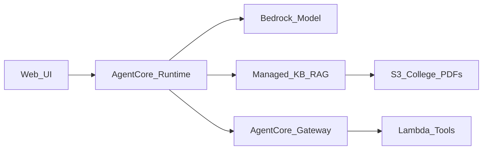
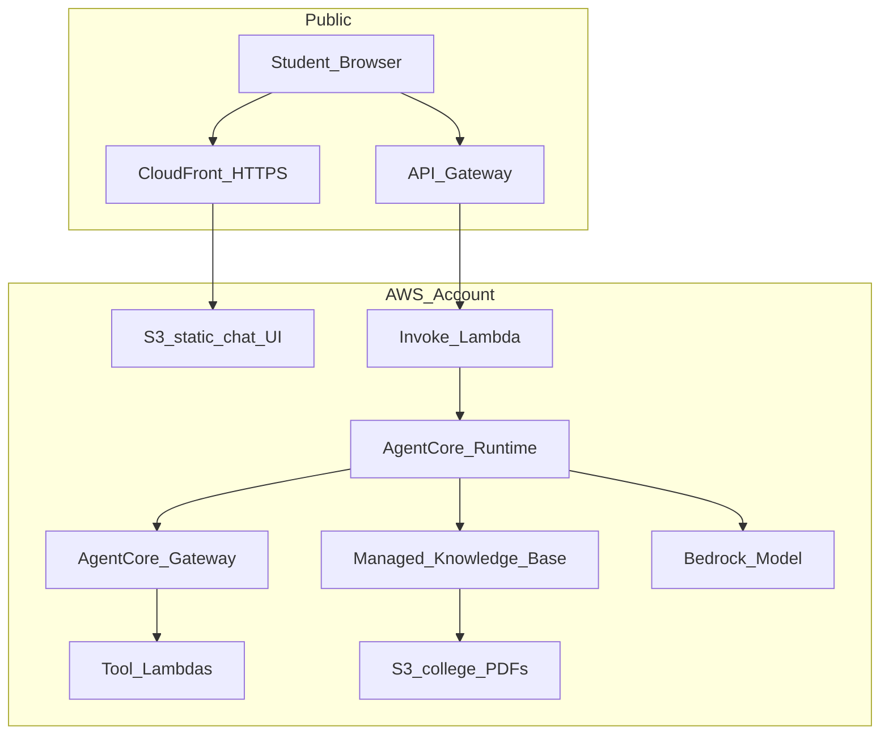
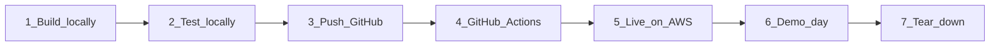

# College Chatbot Demo: POV and Recommended Approach

## Verdict

**Strong topic. Keep it.** College rules/exams/admission is familiar to both audiences, makes RAG obvious (answers must come from policy docs), and naturally needs agents (check deadlines, fee lookup, escalate to human). Your empty workspace [`d:\work\aws\bedrock-agentcore`](d:\work\aws\bedrock-agentcore) is fine for a greenfield demo.

Treat **AgentCode** as **Amazon Bedrock AgentCore** (Runtime + Gateway + Managed Knowledge Base / RAG).

---

## Why this works for the audience

| Audience | What they care about | How the chatbot shows it |
|---|---|---|
| College students | “Does AI actually help me?” | Ask admission/exam questions; see cited answers from handbooks |
| Professionals | “Is this production-ready?” | AgentCore Runtime hosting, tools via Gateway, observability, guardrails |

One product story covers the full stack without feeling like a random AWS feature dump.

---

## Architecture to demo (keep it to 4 layers)

1. **Bedrock model** – Claude / Nova for generation  
2. **RAG** – AgentCore **Managed Knowledge Base** over S3 PDFs (admission, exam, regulations, fees). **No OpenSearch Serverless.**  
3. **Agents** – tool-using agent (not chat-only): e.g. `get_exam_schedule`, `check_admission_deadline`, `create_ticket`  
4. **AgentCore** – deploy agent on **AgentCore Runtime**; expose tools via **Gateway**; live URL for the demo  

Do **not** also demo SageMaker training, custom vector DBs, multi-agent swarms, or fine-tuning in the same talk. One vertical slice beats a zoo of services.

---

## Demo script (15–20 minutes live)

Use **scripted questions** you rehearsed; keep a fallback recording if Wi‑Fi dies.

1. **Hook (1 min)** – “Students ask the same policy questions every day. Here’s an AWS-grounded assistant.”  
2. **RAG only (3 min)** – “What is the attendance rule for semester exams?” → answer **with citation** from handbook chunk. Show that without KB it hallucinates / refuses.  
3. **Multi-doc RAG (3 min)** – “I missed the mid-sem due to medical leave—what do regulations say?” → agent retrieves from **rules + exam policy**.  
4. **Agent + tools (5 min)** – “When is the last date for B.Tech admission this year?” → tool reads structured deadline data (not only PDF). Optional: “File a query ticket” → Lambda mock ticket ID.  
5. **Hosting (3 min)** – Show AgentCore Runtime / console: deployed agent, session isolation, live public HTTPS UI.  
6. **Pro close (2 min)** – Guardrails (PII / off-topic), cost note (tokens + KB), observability (trace: retrieve → reason → tool).  

**Audience Q&A seed:** “Where does truth come from?” → Knowledge Base. “When do we need an agent?” → when the model must **act** (API/tool), not only **read**.

---

## Content strategy (critical for credibility)

- Use **sample / anonymized** college PDFs (admission brochure, exam rules, code of conduct). No real student data.  
- Split KB into clear folders: `admission/`, `exams/`, `regulations/`, `fees/`.  
- Prefer **short, well-structured PDFs** (or Markdown) so retrieval looks good live.  
- Always show **citations** in the UI—this is the trust moment for both audiences.

---

## How the app is deployed on AWS

No EC2. Everything is serverless. Three deployable pieces:

### Piece 1 — Agent (backend brain)

1. Write agent code locally (Python; e.g. Strands or LangGraph).
2. Package with **AgentCore CLI** as **direct code deploy** (ZIP) — **no Docker / ECR**.
3. Deploy to **AgentCore Runtime** → agent endpoint ARN.
4. Runtime calls **Bedrock** for the model and **Managed Knowledge Base** for RAG.

### Piece 2 — Tools + RAG data

1. Upload sample college PDFs/Markdown to **S3** (`admission/`, `exams/`, `regulations/`, `fees/`).
2. Create **Managed Knowledge Base** pointed at that S3 prefix; sync once.
3. Deploy 2–3 **Lambda** functions (deadlines, schedule, ticket).
4. Register Lambdas on **AgentCore Gateway** so the Runtime agent can call them as tools.

### Piece 3 — Chat UI (what the audience opens)

See **UI to build** below. Deploy: build → S3 → CloudFront; API calls go to API Gateway.

### Deploy order (demo day prep)

1. S3 docs → Managed KB sync  
2. Tool Lambdas → Gateway  
3. Agent → AgentCore Runtime (`agentcore` CLI)  
4. Invoke Lambda + API Gateway  
5. Chat UI → S3 → CloudFront  
6. Smoke-test 5 golden prompts  
7. After talk: tear down Runtime / KB / CloudFront / API (keep code in git)

### What you show on stage for “live hosting”

- CloudFront URL in browser (chat works)  
- Console: AgentCore Runtime agent = Active  
- Optional: one Observability / CloudWatch trace for a question  

---

## Hosting recommendation (summary)

- **Agent:** AgentCore Runtime via AgentCore CLI — **direct code (ZIP) deploy, no Docker**  
- **Docs:** S3 → Managed Knowledge Base only (**no OpenSearch Serverless**)  
- **Tools:** Lambda behind AgentCore Gateway  
- **Public entry:** CloudFront → S3 UI → API Gateway → Invoke Lambda → AgentCore Runtime  
- **Region:** AgentCore-supported region (`ap-south-1` if available, else `us-east-1`)  
- **No EC2**

---

## How we push to AWS: GitHub Actions (not Console-first)

**Locked choice: GitHub CI/CD.** Console is only for one-time bootstrap. Day-to-day and on-stage “how we ship” story = push to `main` → pipeline deploys.

### Why not Console-only

- Hard to repeat before the talk  
- Weak story for professionals  
- Easy to misconfigure under time pressure  

### One-time Console bootstrap (once per account/region)

1. Enable Bedrock model access (Haiku / Nova)  
2. Create IAM deploy role / OIDC for GitHub Actions  
3. Confirm AgentCore available in the chosen region  
4. Set AWS Budgets alert ($25 / $50)  

### Ongoing deploy: GitHub Actions

Repo workflow `.github/workflows/deploy.yml` on push to `main` (and manual `workflow_dispatch`):

1. Build `ui/` (Vite)  
2. Sync docs → S3; trigger Managed KB sync if needed  
3. Deploy tool Lambdas + Invoke Lambda + API Gateway (SAM/CDK or AWS CLI) — ZIP packages, no containers  
4. Deploy agent to AgentCore Runtime via **direct code deploy** (ZIP; `agentcore` CLI) — **no Docker/ECR**  
5. Upload `ui/dist` → S3; invalidate CloudFront  

**Docker:** not used in this project. (Container deploy exists in AgentCore but is out of scope for CampusAssist.)

**Secrets in GitHub:** `AWS_ROLE_ARN` via OIDC (preferred) or access keys for the demo account only.

### On-stage line

“We don’t click-deploy. Code is in GitHub; Actions pushes the UI and agent to AWS. Here’s the live CloudFront URL.”

### Tear-down

Separate workflow or `scripts/teardown.sh` (manual dispatch) to delete Runtime/KB/API/CloudFront after the event.

---

## UI to build

**One product only:** a single-page **CampusAssist** college chatbot (not a dashboard, not an admin console).

### Tech

- **Vite + vanilla HTML/CSS/JS** (single page; no React/Next)  
- Static build → **S3 + CloudFront**  
- Talks to **API Gateway** `POST /chat` with `{ message, sessionId }`  

### Screens (exactly 1)

| Area | What it shows |
|---|---|
| Header | Brand **CampusAssist** + subtitle (“College rules, exams & admission”) |
| Suggested prompts | 5 clickable chips (golden demo questions) |
| Chat thread | User / assistant bubbles |
| Citations | Under each answer: source doc name + snippet (from RAG) |
| Input | Text box + Send; Enter to send |
| Footer | “Powered by Amazon Bedrock + AgentCore” |

### Must-have behavior

- Full reply per turn (streaming optional; not required for demo)
- Show **citations** when KB is used
- Show **tool used** badge when agent calls a tool (e.g. “Checked admission deadline”)
- Loading state while waiting
- Error message if API fails
- `sessionId` in `sessionStorage` for multi-turn on stage

### Explicitly NOT building

- Login / Cognito  
- Admin upload UI  
- Multi-page site / student portal  
- Charts, stats, settings  
- Mobile native app  

### Look

- Campus blue/teal + white; expressive font (e.g. Source Sans / IBM Plex—not Inter/Roboto)
- One chat composition; no card-grid hero
- Prompt chips + composer are the only interactive containers

### Golden prompt chips (hardcoded)

1. What is the minimum attendance for semester exams?  
2. Can I get medical leave for a missed mid-sem?  
3. Last date for B.Tech admission this year?  
4. What documents are required for admission?  
5. Raise a support ticket for fee clarification  

### Repo folder

`ui/` — Vite app; deploy `ui/dist` to S3.

## AWS services count (demo stack)

**8 core services** (architecture slide):

1. **Amazon Bedrock** – foundation model  
2. **Amazon Bedrock AgentCore Runtime** – host the agent  
3. **Amazon Bedrock AgentCore Gateway** – tool access  
4. **Bedrock Managed Knowledge Base** – RAG  
5. **Amazon S3** – docs + static UI  
6. **AWS Lambda** – tools + one Runtime invoke proxy  
7. **Amazon API Gateway** – public HTTPS API for the chat UI  
8. **Amazon CloudFront** – public chat URL  

**Plus supporting:** IAM, CloudWatch. **Optional:** Bedrock Guardrails.

**Hard exclusion:** OpenSearch Serverless, EC2, RDS, SageMaker, **Docker/ECR for agent packaging**.

**Slide line:** “8 AWS services, one vertical slice—no VMs.”

---

## Average costing (USD, approximate)

Prices change; treat as **order-of-magnitude for planning**. Confirm on [Bedrock pricing](https://aws.amazon.com/bedrock/pricing/) and [AgentCore pricing](https://aws.amazon.com/bedrock/agentcore/pricing/).

### Cost drivers (ranked)

1. **Model tokens (Bedrock)** – usually largest share of active demo spend  
2. **Idle vector store** – not applicable (OpenSearch Serverless excluded; Managed KB only)  
3. **AgentCore Runtime** – only while agent is actively computing (~$0.0895/vCPU-hour + ~$0.00945/GB-hour)  
4. **Gateway / Lambda / S3 / CloudFront** – cents for a college talk  

### Assumed demo profile

- Model: **Claude Haiku** (~$1 / $5 per 1M input/output tokens) or cheaper **Nova Lite**  
- Corpus: ~20–50 short PDFs  
- Traffic: build + rehearse + 1 live session (~100–300 chat turns total)  
- Stack: Managed KB path (no OpenSearch Serverless)

### Budget scenarios

| Scenario | Duration | Approx. cost | Notes |
|---|---|---|---|
| **Talk-week only** | Build 3–5 days + demo day, then tear down | **$5–25** | Tokens + tiny Runtime/Gateway/S3/CF |
| **Live URL for 1 month** (light use) | Always-on UI, few hundred queries | **$15–50** | Managed KB path; still delete after event |
| **Heavy workshop** (class of 50 hammering chat) | 1 day | **$30–80** | Prefer Haiku/Nova; set account spend alert |

### Rough per-query math (for the Q&A slide)

- ~2K input + ~400 output tokens on Haiku ≈ **$0.004–0.01 per question** (before Runtime)  
- 200 demo questions ≈ **$1–2** in model cost  
- Runtime for short sessions: usually **under a few dollars** for a talk week  

### Cost control checklist (put in README)

- Prefer **Haiku / Nova Lite**, not Sonnet/Opus for the live demo  
- **Managed Knowledge Base only** (OpenSearch Serverless excluded by design)  
- Skip AgentCore **long-term Memory** unless you need it on stage  
- Set **AWS Budgets alert** at $25 / $50  
- **Tear down** Runtime agent, KB, CloudFront after the presentation  

**One-liner for audience:** “RAG via Managed Knowledge Base—no OpenSearch Serverless to babysit or pay idle for.”

---

## Risks and how to avoid them

- **Scope creep** – Build one agent, one KB, 3 tools, one UI.  
- **Live demo failure** – Rehearse 5 golden prompts; have screenshots/video backup.  
- **Hallucinations** – Instruct “answer only from KB”; show refusal for off-policy questions.  
- **Cost surprise** – Cap tokens; delete unused resources after the event.  
- **Over-claiming** – Say “demo / sample college corpus,” not “production SIS replacement.”

---

## Suggested talk outline (total ~45–60 min)

1. Problem (campus FAQ overload) – 5 min  
2. Concepts: Bedrock → RAG → Agents → AgentCore – 15 min (diagram on slide)  
3. Live demo – 15–20 min  
4. Architecture deep-dive for professionals – 10 min  
5. Q&A – 10 min  

---

## Start-to-end: build → test → GitHub → AWS

### Phase 0 — AWS account bootstrap (Console, once)

1. Pick region (AgentCore available; prefer `ap-south-1` else `us-east-1`)
2. Enable Bedrock model access (Haiku or Nova Lite)
3. Create IAM role for GitHub Actions OIDC → AWS
4. Set AWS Budget alerts ($25 / $50)
5. Create empty GitHub repo (or use this workspace repo)

### Phase 1 — What we build (local repo)

| Folder / piece | What it is |
|---|---|
| `docs/kb/` | Sample college Markdown/PDFs (admission, exams, regulations, fees) |
| `agent/` | Python agent (RAG via Managed KB + 3 tools) |
| `lambda/tools/` | `get_admission_deadline`, `get_exam_schedule`, `create_ticket` |
| `lambda/invoke/` | API proxy → AgentCore Runtime |
| `infra/` | SAM/CDK or CLI templates (API Gateway, Lambdas, S3, CloudFront, IAM) |
| `ui/` | CampusAssist Vite chat (citations, prompt chips) |
| `.github/workflows/deploy.yml` | CI/CD |
| `scripts/teardown.sh` | Post-demo cleanup |
| `README.md` | Golden prompts + deploy notes |

**No Docker. No OpenSearch Serverless. No EC2.**

### Phase 2 — What we test (before / after AWS)

**A. Local (dev machine)**

1. Unit-test tool Lambdas (deadline returns expected date; ticket returns ID)
2. Run UI locally (`vite`) against a mock `/chat` or deployed API
3. Agent smoke: 5 golden prompts against a local/dev Runtime if available

**B. After first AWS deploy (staging smoke)**

| # | Test | Pass if |
|---|---|---|
| 1 | Attendance rule question | Answer + citation from regulations doc |
| 2 | Medical leave + mid-sem | Answer spanning exams + regulations |
| 3 | B.Tech admission last date | Tool badge + structured deadline |
| 4 | Admission documents list | Citation from admission brochure |
| 5 | Raise fee ticket | Tool returns ticket ID |
| 6 | Off-topic (“write a poem about Mars”) | Refuse / stay on college KB |
| 7 | CloudFront URL loads HTTPS | Chat UI reachable |
| 8 | Multi-turn follow-up | Same `sessionId` keeps context |

**C. Pre-talk rehearsal**

- Run all 5 golden chips on stage Wi‑Fi  
- Confirm Console shows AgentCore Runtime = Active  
- Have 30s screen recording backup  

### Phase 3 — Push to GitHub

1. `git init` (if needed) → add remote  
2. Commit code (never commit AWS keys; use OIDC / GitHub secrets)  
3. `git push origin main`  
4. Optional: protect `main`; use PRs for changes after first ship  

### Phase 4 — GitHub Actions → AWS

On push to `main` (or manual `workflow_dispatch`):

1. Checkout + install deps  
2. Build `ui/` → artifact  
3. Sync `docs/kb/` → S3 docs bucket; kick Managed KB sync  
4. Deploy Lambdas (tools + invoke) + API Gateway  
5. Package agent ZIP → AgentCore Runtime direct code deploy  
6. Upload UI to S3 → CloudFront invalidation  
7. Print CloudFront URL in Actions log / README  

**You do not click-deploy the app each time.** Console stays for bootstrap + live Observability demo.

### Phase 5 — Live demo day

1. Open CloudFront CampusAssist URL  
2. Click golden prompts 1→5 in order  
3. Show citation under a RAG answer  
4. Show tool badge on admission deadline  
5. Optional: Console Observability trace for one question  
6. Q&A: “truth from KB; actions from tools; host is AgentCore”

### Phase 6 — Tear down (after event)

1. Run `scripts/teardown.sh` or Actions `teardown` workflow  
2. Delete Runtime agent, KB, API, CloudFront distribution, unused S3  
3. Keep GitHub repo as the deliverable  

### Timeline (realistic)

| Day | Focus |
|---|---|
| 1 | Bootstrap AWS + repo skeleton + KB docs |
| 2 | Agent + tools + Managed KB |
| 3 | Invoke API + CampusAssist UI |
| 4 | GitHub Actions pipeline + first full deploy |
| 5 | Test matrix + rehearse + backup recording |

---

## Build scope (when you approve implementation)

Greenfield under this repo as in Phase 1 above. No auth SSO, real SIS, multi-agent, Docker, or OpenSearch Serverless unless you ask later.
