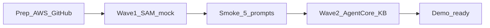

# 07 — AWS push plan

Two-wave push. **Wave 1** gets a live HTTPS demo URL with mock Lambda (works today). **Wave 2** swaps in AgentCore + Managed KB for the full Bedrock story.



---

## Wave 1 goal (recommended first)

Live CampusAssist on CloudFront. Chat API = Invoke Lambda with `MOCK_MODE=true` (same logic as `scripts/local_api.py`).  
No AgentCore CLI required yet. Cost stays tiny.

### What gets created

| Resource | How |
|---|---|
| S3 docs bucket + UI bucket | SAM |
| CloudFront distribution | SAM |
| HTTP API `/chat` + Invoke Lambda | SAM |
| Tool Lambdas (deadline, schedule, ticket) | SAM |
| KB Markdown under `s3://…/kb/` | Actions `aws s3 sync` |

---

## Prerequisites checklist (you do once)

### A. AWS account

- [ ] AWS account access (CLI or Console)
- [x] Pick region: **`us-east-1`** (locked)
- [ ] IAM user/role for yourself (admin or power-user for bootstrap)
- [ ] **AWS Budgets** alert at $25 and $50
- [ ] (Optional for Wave 1) Bedrock model access — needed only for Wave 2

### B. GitHub repo

- [ ] Create empty GitHub repo (e.g. `campusassist` / `bedrock-agentcore`)
- [ ] Local git: `git init` → remote → push `main` (do **not** commit `.env`)
- [ ] Confirm `.env` is gitignored

### C. GitHub → AWS OIDC role

Create IAM role `campusassist-github` trusted by:

- Federated: `token.actions.githubusercontent.com`
- Condition: your org/repo `repo:YOUR_ORG/YOUR_REPO:ref:refs/heads/main` (and `workflow_dispatch` if needed)

Attach permissions sufficient for:

- CloudFormation / SAM deploy
- S3, Lambda, API Gateway, CloudFront, IAM (pass role)
- Later Wave 2: Bedrock + AgentCore

### D. GitHub Actions **variables** (Settings → Variables)

| Name | Value for Wave 1 |
|---|---|
| `AWS_ROLE_ARN` | `arn:aws:iam::ACCOUNT:role/campusassist-github` |
| `AWS_REGION` | `us-east-1` or `ap-south-1` |
| `DOCS_BUCKET` | Globally unique, e.g. `campusassist-kb-YOURNAME-2026` |
| `MOCK_MODE` | `true` |

Leave empty for Wave 1: `AGENT_RUNTIME_ARN`

---

## Push sequence — Wave 1

1. Confirm local tests green: `python -m unittest discover -s lambda/tests -v`
2. Commit all app code (no secrets)
3. `git push -u origin main`
4. Actions → **Deploy CampusAssist** runs (or auto on push)
5. Open job summary → copy **UI** (CloudFront) and **API** URLs
6. Browser smoke: all 5 golden prompts ([03-TEST-PLAN.md](03-TEST-PLAN.md) A1–A8)
7. Bookmark CloudFront URL for slides

### If Actions fails

| Symptom | Fix |
|---|---|
| `AWS_ROLE_ARN not set` | Add repo variable |
| OIDC AssumeRole denied | Fix trust policy repo name / branch |
| Bucket already exists | Change `DOCS_BUCKET` |
| SAM changeset error | Check CloudFormation Events in Console |

### Local SAM alternative (no GitHub yet)

```bash
# After AWS CLI configured
sam deploy --template-file infra/template.yaml --stack-name campusassist \
  --resolve-s3 --capabilities CAPABILITY_IAM \
  --parameter-overrides ProjectName=campusassist MockMode=true \
    DocsBucketName=YOUR_UNIQUE_BUCKET
aws s3 sync docs/kb s3://YOUR_UNIQUE_BUCKET/kb/
# Build UI with API from stack outputs, sync to UiBucket, invalidate CF
```

Prefer GitHub Actions once OIDC works — matches the talk narrative.

---

## Wave 2 goal (full Bedrock + AgentCore story)

Do this after Wave 1 URL works.

1. Console: enable Bedrock model (Nova Lite / Haiku) in same region  
2. Create **Managed Knowledge Base** → data source `s3://$DOCS_BUCKET/kb/` (**no OpenSearch Serverless**)  
3. Install AgentCore CLI locally; from `agent/`: direct code deploy (ZIP — CLI packages it)  
4. Note Runtime ARN → set GitHub var `AGENT_RUNTIME_ARN`  
5. Set `MOCK_MODE=false`  
6. Re-run **Deploy CampusAssist**  
7. Wire Gateway tools to the three tool Lambdas (Console/CLI)  
8. Smoke A1–A8 again; confirm tool badges + citations still show  

Talk line: “Wave 1 proved hosting; Wave 2 swapped the brain to AgentCore + Managed KB.”

---

## Order of work this week

| Step | Owner | Blocking? |
|---|---|---|
| 1. Choose region + create `DOCS_BUCKET` name | You | Yes |
| 2. Create GitHub repo + OIDC role | You | Yes |
| 3. Set Actions variables | You | Yes |
| 4. First `git push` / workflow_dispatch | You or agent | Yes |
| 5. Smoke CloudFront URL | You | Yes |
| 6. Wave 2 AgentCore + Managed KB | You + agent | After demo URL OK |
| 7. Tear down after talk | You | Post-event |

---

## Out of scope for first push

- Custom domain / ACM certificate  
- Cognito login  
- Docker / ECR  
- OpenSearch Serverless  

---

## Status (2026-09-05)

| Item | Status |
|---|---|
| Region | **us-east-1** (locked) |
| GitHub | https://github.com/zuber-surya/bedrock-agentcore |
| Wave 1 API | **Live** `https://3wfx35hyp2.execute-api.us-east-1.amazonaws.com/prod/chat` (`MOCK_MODE=true`) |
| CloudFront UI | **Blocked** — AWS account must be verified for CloudFront (open Support case) |
| GitHub Actions OIDC | Role created; AssumeRoleWithWebIdentity still failing — use local `sam deploy` until fixed |
| Docs bucket | `campusassist-kb-zubersurya-771495376060` |

### Use live API with local UI

```powershell
cd ui
$env:VITE_API_URL="https://3wfx35hyp2.execute-api.us-east-1.amazonaws.com/prod/chat"
npm run dev
```

### Unblock CloudFront later

AWS Console → Support → Account verification for CloudFront → then restore CF resources in `infra/template.yaml` and set GitHub var `ENABLE_CLOUDFRONT=true`.
